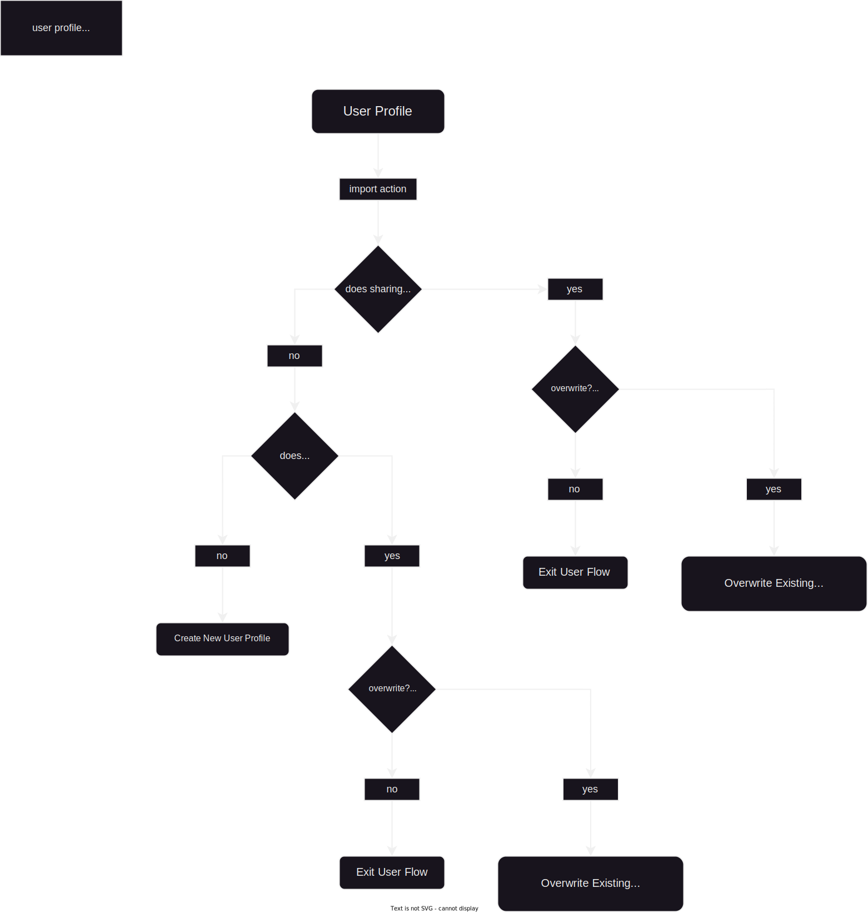

# Sync

Generally it'd be nice to be able to import/export/share/sync profiles to the platform specific accounts.
The general approach to how it would be done is just plain old JSON files.

The import procedure logic would look like the following diagram:

